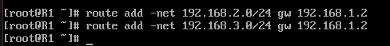
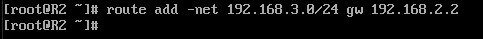
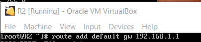
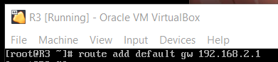

# Báo cáo bài tập lớn Mạng Máy Tính


## 1. Cài đặt môi trường
- Tải và cài đặt Virtual Box. (tải và cài thành công, không có lỗi)

- Tải iso CentOS. (ok)

- Cài đặt và cấu hình R1:
  + Adapter 1: NAT, MAC: 08002748D000 ứng với eth1 trên R1
  + Adapter 2: Internal network, name: LAN01, MAC: 0800277BC8C3 ứng với eth2 trên R1
  + Thiết lập IP tĩnh cho eth2 của R1: `ifconfig eth2 192.168.1.1/24`
  + Cấu hình R1 thành NAT của LAN01:
    ```sh
    > sysctl -w net.ipv4.ip_forward=1
    > iptables -D FORWARD -j REJECT --reject-with icmp-host-prohibited
    > iptables -t nat -A POSTROUTING -o eth1 -j MASQUERADE
    ```
 + Sử dụng file.sh với nội dung như trên để tự động cấu hình R1 thành router mỗi lần mở
 
- Cài đặt và cấu hình máy trạm A:
  + Clone A từ R1
  + Adapter 1: Internal Network, name: LAN01, MAC: 0800272BCE01 ứng với eth4 trên A
  + Tắt Adapter 2
  + Viết file cấu hình `/ect/sysconfig/network-scripts/ifcfg-eth4` với nội dung:
    ```sh
    DEVICE=eth4
    BOOTPROTO=dhcp
    ONBOOT=yes
    IPADDR=192.168.1.20
    NETMASK=255.255.255.0
    ```
  + Thêm default gateway:
    ```sh
    > route add default gw 192.168.1.1
    ```

- Kiểm tra kết nối giữa R1 và A:
  + Tại R1:
    ```sh
    > ping -c3 google.com  
    > ping 192.168.1.20
    ```
    
  + Tại A:
    ```sh
    > ping -c3 192.168.1.1
    > ping -c3 google.com
    > tracepath google.com
    ```
    

- Clone R2, R3 từ R1.
  + R2:
    + Adapter 1: Internal Network, name: LAN01, MAC: 08002748E000 ứng với eth3 của R2
    + Adapter 2: Internal Network, name: LAN02, MAC: 0800277C6305 ứng với eth4 của R2
    + Thiết lập R2 thành router:
      ```sh
      > sysctl -w net.ipv4.ip_forward=1
      > iptables -D FORWARD -j REJECT --reject-with icmp-host-prohibited
      > iptables -t nat -A POSTROUTING -o eth3 -j MASQUERADE
      ```
    + Sử dụng file.sh với nội dung như trên để tự động cấu hình R2 thành router mỗi lần mở
    
  + R3:
    + Adapter 1: Internal Network, name: LAN02, MAC: 08002748F000 ứng với eth3 của R2
    + Adapter 2: Internal Network, name: LAN03, MAC: 0800277BCAFE ứng với eth4 của R2
    + Thiết lập R3 thành router:
      ```sh
      > sysctl -w net.ipv4.ip_forward=1
      > iptables -D FORWARD -j REJECT --reject-with icmp-host-prohibited
      > iptables -t nat -A POSTROUTING -o eth3 -j MASQUERADE
      ```
    + Sử dụng file.sh với nội dung như trên để tự động cấu hình R3 thành router mỗi lần mở
    
- Clone B, X từ A.
- Cấu hình mạng giống với sơ đồ:
  

- Cấu hình bảng router:
  + R1:
    ```sh
    > route add -net 192.168.2.0/24 gw 192.168.1.2
    > route add -net 192.168.3.0/24 gw 192.168.1.2
    ```
    
  + R2:
    ```sh
    > route add -net 192.168.3.0/24 gw 192.168.2.2
    ```
    
  + R3:
    ```sh
    > route add -net 192.168.1.0/24 gw 192.168.2.1
    ```
    

- Cấu hình default gateway ra Internet:
  + R2:
    ```sh
    > route default gw 192.168.1.1
    ```
    
  + R3:
    ```sh
    > route default gw 192.168.2.1
    ```
    

- Route tables:
  + R1:
  
  + R2:
  
  + R3:
  

## 2. ping giữa hai trạm xa nhất

## 3. tracepath giữa hai trạm xa nhất
