# Báo cáo bài tập lớn Mạng Máy Tính


## 1. Cài đặt môi trường
- Tải và cài đặt Virtual Box. (tải và cài thành công, không có lỗi)

- Tải iso CentOS. (ok)

- Cài đặt và cấu hình R1:
  + Adapter 1: NAT, MAC: 08002748D000 ứng với eth1 trên R1
  + Adapter 2: Internal network, name: LAN01, MAC: 0800277BC8C3 ứng với eth2 trên R1
  + Thiết lập IP tĩnh cho eth2 của R1: `ifconfig eth2 192.168.1.1/24`
  + Cấu hình R1 thành NAT của LAN01:
    ```sh
    > sysctl -w net.ipv4.ip_forward=1
    > iptables -D FORWARD -j REJECT --reject-with icmp-host-prohibited
    > iptables -t nat -A POSTROUTING -o eth1 -j MASQUERADE
    ```
  + Sửa `net.ipv4.ip_forward = 1` trong file `/etc/sysctl.conf` để không phải cấu hình lại
 
- Cài đặt và cấu hình máy trạm A:
  + Clone A từ R1
  + Adapter 1: Internal Network, name: LAN01, MAC: 0800272BCE01 ứng với eth4 trên A
  + Tắt Adapter 2
  + Viết file cấu hình `/ect/sysconfig/network-scripts/ifcfg-eth4` với nội dung:
    ```sh
    DEVICE=eth4
    BOOTPROTO=static
    ONBOOT=yes
    IPADDR=192.168.1.20
    NETMASK=255.255.255.0
    ```
  + Thêm default gateway:
    ```sh
    > route add default gw 192.168.1.1
    ```

- Kiểm tra kết nối giữa R1 và A:
  + Tại R1:
    ```sh
    > ping -c3 google.com  
    > ping 192.168.1.20
    ```
    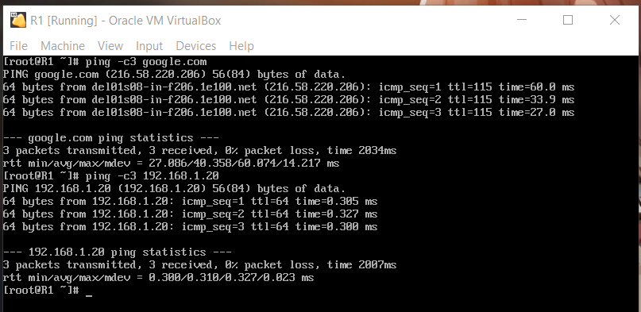
  + Tại A:
    ```sh
    > ping -c3 192.168.1.1
    > ping -c3 google.com
    > tracepath google.com
    ```
    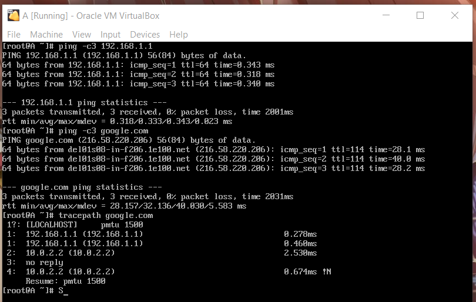

- Clone R2, R3 từ R1.
  + R2:
    + Adapter 1: Internal Network, name: LAN01, MAC: 08002748E000 ứng với eth3 của R2
    + Adapter 2: Internal Network, name: LAN02, MAC: 0800277C6305 ứng với eth4 của R2
    + Thiết lập R2 thành router:
      ```sh
      > sysctl -w net.ipv4.ip_forward=1
      > iptables -D FORWARD -j REJECT --reject-with icmp-host-prohibited
      ```
    + Sửa `net.ipv4.ip_forward = 1` trong file `/etc/sysctl.conf` để không phải cấu hình lại
      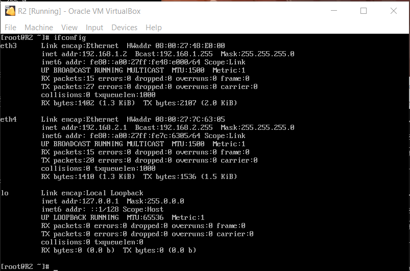
  + R3:
    + Adapter 1: Internal Network, name: LAN02, MAC: 08002748F000 ứng với eth3 của R2
    + Adapter 2: Internal Network, name: LAN03, MAC: 0800277BCAFE ứng với eth4 của R2
    + Thiết lập R3 thành router:
      ```sh
      > sysctl -w net.ipv4.ip_forward=1
      > iptables -D FORWARD -j REJECT --reject-with icmp-host-prohibited
      > iptables -t nat -A POSTROUTING -o eth3 -j MASQUERADE
      ```
    + Sửa `net.ipv4.ip_forward = 1` trong file `/etc/sysctl.conf` để không phải cấu hình lại
      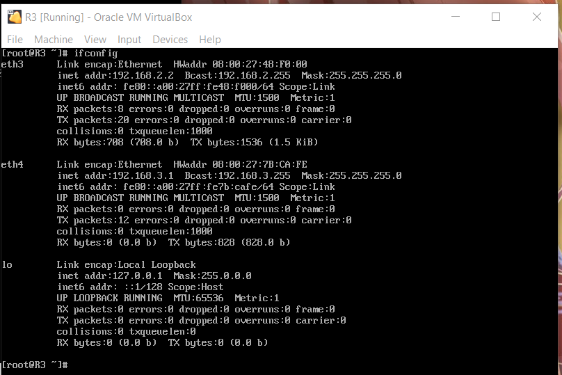
- Clone B, X từ A.
  + B: Viết file cấu hình `/ect/sysconfig/network-scripts/ifcfg-eth5` với nội dung:
    ```sh
    DEVICE=eth5
    BOOTPROTO=static
    ONBOOT=yes
    IPADDR=192.168.1.21
    NETMASK=255.255.255.0
    GATEWAY=192.168.1.1
    ```
  + X: Viết file cấu hình `/ect/sysconfig/network-scripts/ifcfg-eth5` với nội dung:
    ```sh
    DEVICE=eth5
    BOOTPROTO=static
    ONBOOT=yes
    IPADDR=192.168.3.20
    NETMASK=255.255.255.0
    GATEWAY=192.168.3.1
    ```
- Cấu hình mạng giống với sơ đồ:
  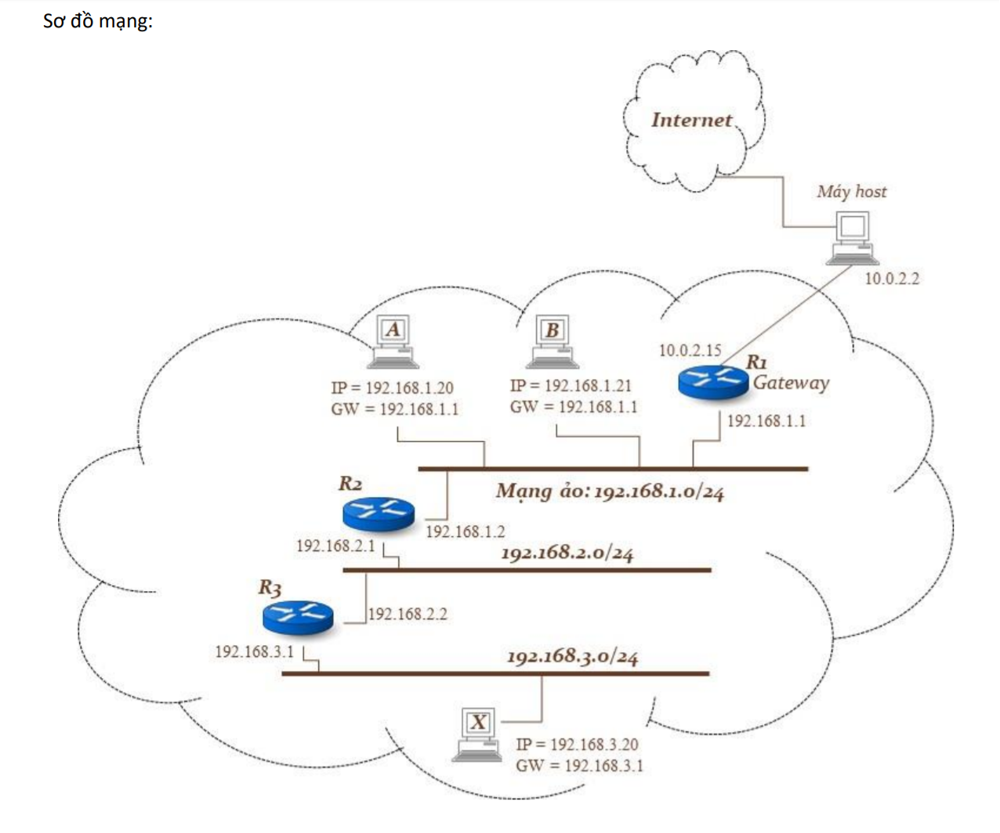

- Cấu hình bảng router:
  + R1:
    ```sh
    > echo '192.168.2.0/24 via 192.168.1.2' > /etc/sysconfig/network-scripts/route-eth2
    > echo '192.168.3.0/24 via 192.168.1.2' >> /etc/sysconfig/network-scripts/route-eth2
    ```
  + R2:
    ```sh
    > echo 'default via 192.168.1.1' > /etc/sysconfig/network-scripts/route-eth3
    > echo '192.168.3.0/24 via 192.168.2.2' > /etc/sysconfig/network-scripts/route-eth4
    ```
  + R3:
    ```sh
    > echo 'default via 192.168.2.1' > /etc/sysconfig/network-scripts/route-eth3
    > echo '192.168.1.0/24 via 192.168.2.1' >> /etc/sysconfig/network-scripts/route-eth3
    ```
- Route tables:
  + R1:
    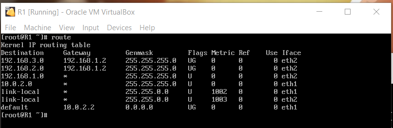
  + R2:
    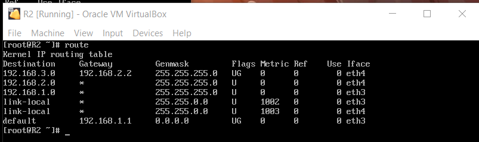
  + R3:
    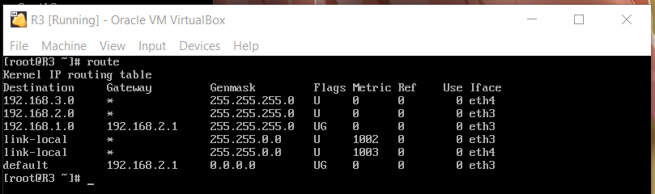

## 2. ping giữa hai trạm xa nhất
- ping từ X đến B:
  + Tại máy X:
    ```sh
    > ping -c5 192.168.1.21
    ```
    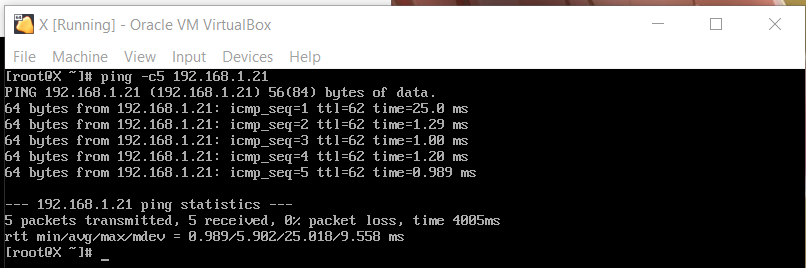
  + Log tại R2:
    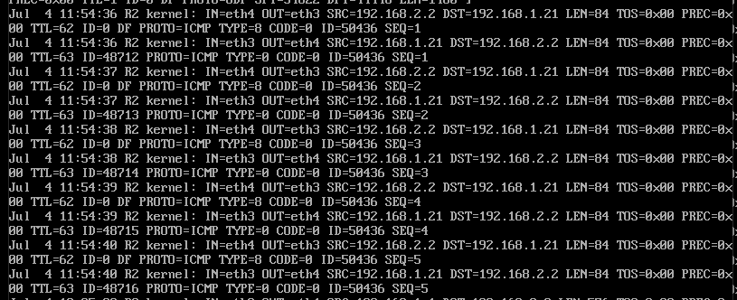
  + Log tại R3:
    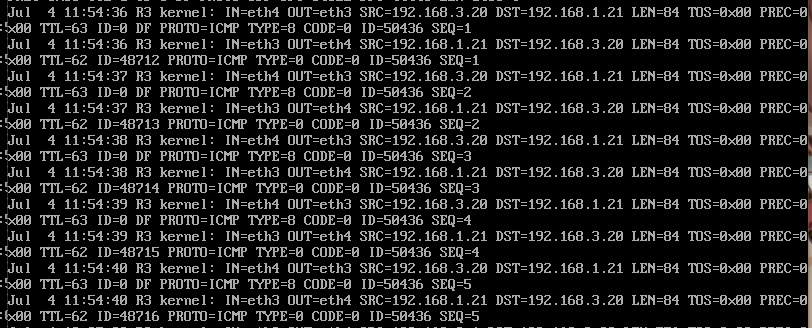

- ping từ A đến X khi R2 với kịch bản "destination unreachable"
  + Xóa route của R2
    ```sh
    > route del -net 192.168.3.0/24 gw 192.168.2.2
    ```
  + Tại máy A:
    ```sh
    > ping -c5 192.168.3.20
    ```
    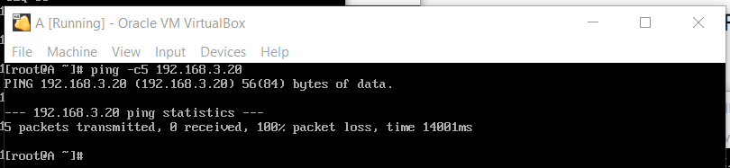
  + Log tại R1:
    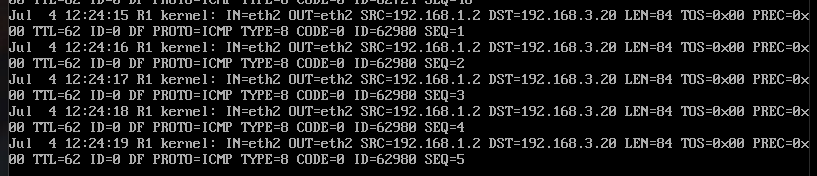
  + Log tại R2:
    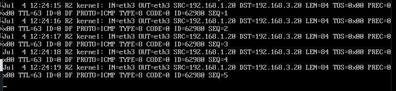
- ping từ A đến X với kịch bản "time out"
  + Xóa route của R3
    ```sh
    > route del -net 192.168.1.0/24 gw 192.168.2.1
    ```
    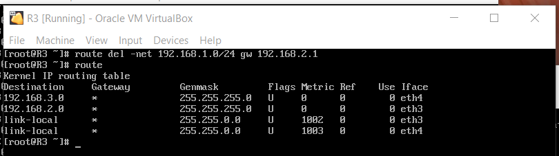
  + ping từ A đến X:
    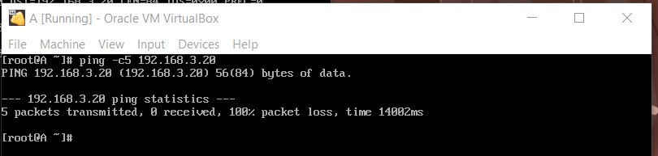
  + Log tại R2:
    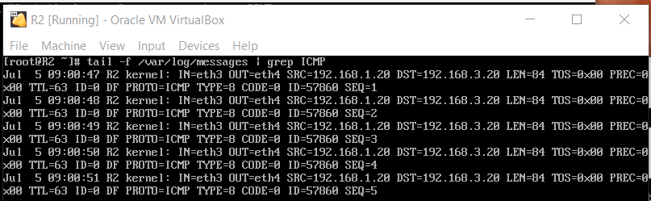
## 3. tracepath giữa hai trạm xa nhất
- Bật công cụ iptables trên R1, R2 & R3:
  ```sh
  > service iptables start
  > service iptables status
  > iptables -t mangle -A FORWARD -j LOG
  > tail -f /var/log/message | grep ICMP
  ```
- tracepath từ máy A đến máy X:
  + Tại máy A:
    ```sh
    > tracepath 192.168.3.20
    ```
    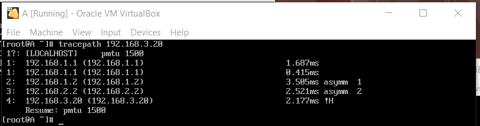
  + Log tại R2:
    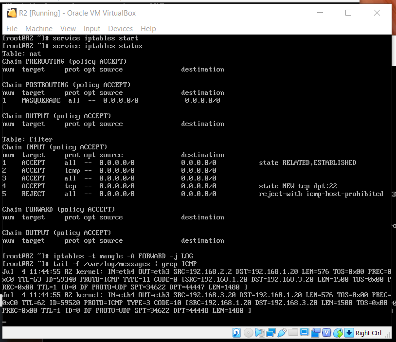
  + Log tại R3:
    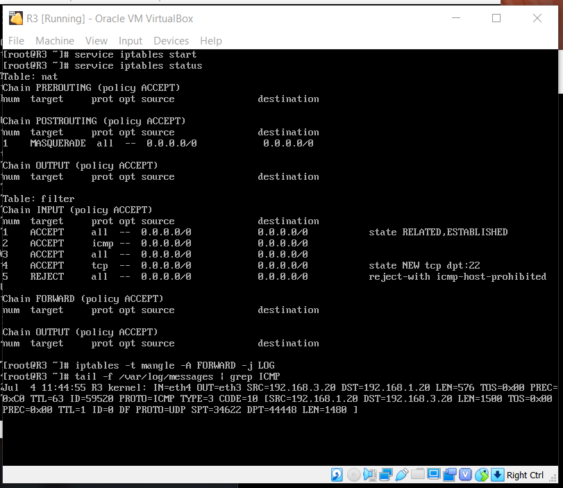
- Phân tích các gói của lệnh ICMP
